# Artificial Intelligence
Yeongmin Ko's learning notes

Fourteen figures, all generated by `make_figures.py`. Each one is a run of the
algorithm it illustrates rather than a diagram of it: the clustering panels
execute the clustering, the classifiers are trained and scored on held-out data,
and every number in a caption came out of that run. Where a method fails, the
figure shows it failing.

#### Difference
- Classification: KNN, Decision Tree
- Regression: Linear and Logistic Regression
- Clustering: K-Means, Agglomerative Clustering, DBSCAN
- 

### 1. Clustering(K-Means, Agglomerative Clustering, DBSCAN)
- Clustering: the process of partitioning a set of data objects that are similar to each other into subsets
  - 
  - Here, each subset is called a cluster
  - 

- K-Means
  - K is the number of clusters (subsets)
  - A centroid-based technique
    - The centroid is the average of the objects belonging to each cluster
  - 

    - In the figure above, K = 4
- Algorithm
  - Step 1. Determine the number of clusters k (k > 0)
  - Step 2. Randomly select k points to set the initial centroids
  - Step 3. Assign every point to its nearest centroid, forming k clusters
  - Step 4. Recompute the centroid of each cluster (compute the mean of each cluster)
  - Step 5. Repeat steps 3-4 until the centroids stop changing

- Agglomerative Clustering
  - Bottom-up strategy
  - Starting by letting each object form its own cluster, repeatedly merge clusters into larger and larger clusters until all objects are contained in a single cluster
- Algorithm
  - Step 1. Each object forms one cluster
  - Step 2. At the lowest level, merge the two nearest clusters into one cluster
  - Step 3. Repeat step 2 until a single cluster remains

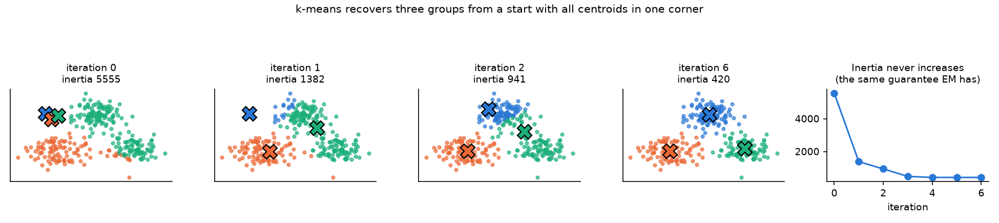

- The figure runs k-means from a deliberately bad start with all three centroids in one corner. It recovers the groups, and the inertia curve on the right never rises — the same monotone guarantee EM has, and for the same reason: k-means is EM on a mixture with hard assignments and shared spherical covariance.

- DBSCAN (density-based clustering)
  - A method that recognizes a group as one cluster if, taking some point as the reference, there are n or more points within a radius
    - Given a point p, if there are m (minPts) points within a distance e (epsilon) from point p, it is recognized as one cluster
  - 

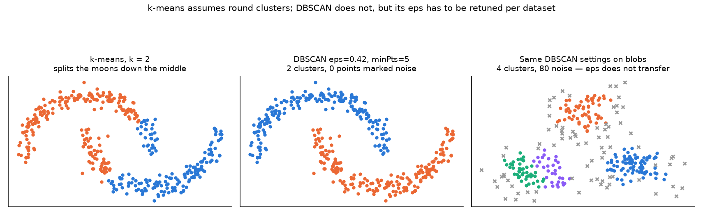

- The three algorithms fail in different places, and the figure shows both directions. k-means assumes clusters are round, so on two interleaved crescents it cuts straight through them. DBSCAN handles that shape because it follows density rather than distance to a centre. But the third panel applies the *same* eps to ordinary blobs and gets a different number of clusters with points thrown out as noise — eps does not transfer between datasets, which is DBSCAN's real cost.

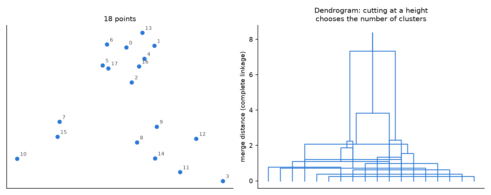

- Agglomerative clustering does not need k in advance. It builds the whole merge tree, and choosing k afterwards is choosing a height to cut at. The vertical axis is the distance at which each merge happened, so a large gap between merges is the data suggesting its own k.

### 2. K-Nearest Neighbors
- K-Nearest Neighbors
  - An algorithm that, when new data comes in, classifies unlabeled data points by assigning them the class of similar labeled data points
- Algorithm
  - Step 1. Determine parameter k, how many surrounding data points to compare against (k > 0)
  - Step 2. Determine similarity by calculating the distance between a test point and all other points in the dataset
  - Step 3. Sort the dataset according to the distance values
  - Step 4. Determine the category of the k-th nearest neighbors
  - Step 5. Use simple majority of the category of the k nearest neighbors as the category of a test point
- Advantages
  - Simple and relatively effective
- Disadvantages
  - Requires selection of an appropriate k
    - If k is too small the model is complex and overfitting occurs
    - If k is too large the model becomes too simple and underfitting occurs
  - Does not produce a model
    - Because no separate trained model is created, computation is required every time for new data, so the computational cost is high
  - Nominal feature and missing data require additional processing
    - Since KNN is mainly used on numeric data, nominal variables have to be converted to numeric form by methods such as label encoding or one-hot encoding, and missing values incur the additional cost of being preprocessed by a separate method

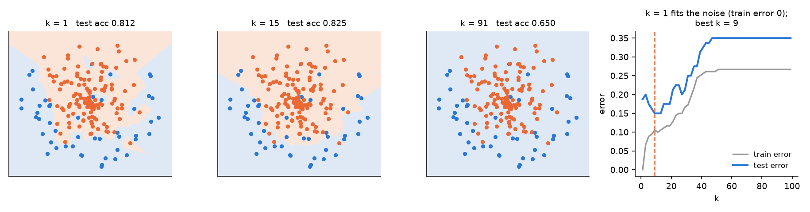

- k is the bias-variance knob, and the curve on the right is measured on held-out data rather than argued. At k = 1 the training error is exactly 0 and the boundary wraps around individual noisy points; at k = 91 the boundary is nearly a straight line and underfits. The test error turns in between, and where it turns is the only defensible way to choose k.

### 3. Naive Bayes
- Bayes' theorem: the theorem describing the relationship between prior probability and posterior probability
- 
- 
- Terminology
  - Hypothesis (H): a hypothesis, or the claim that some event has occurred
  - Evidence (E): new information
  - Likelihood = P(E|H): the possibility that the evidence (E) is observed given the hypothesis (H)
    - Probability vs likelihood
      - Probability: the relative proportion for a particular case
        - Summing over all cases gives 1 (mutually exclusive & exhaustive)
      - Likelihood: the relative proportion with respect to a "hypothesis"
        - Hypotheses can be set up freely, and may even stand in a containment relation to one another (not mutually exclusive & not exhaustive)
  - Prior probability = P(H): the credibility of the claim that some event has occurred
  - Posterior probability = P(H|E): the credibility updated after receiving new information
- Algorithm
  - Step 1. Compute the prior probability for the given class labels
  - Step 2. Compute the likelihood probability from each attribute of each class
  - Step 3. Substitute these values into Bayes' formula and compute the posterior probability
  - Step 4. From the results of steps 1-3 it can be seen which class will have the higher posterior probability (which class the input value is more likely to belong to)

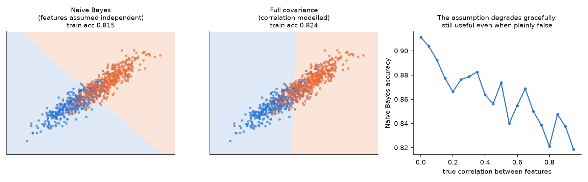

- The "naive" part is assuming the features are independent given the class, which here is plainly false — the two features have correlation 0.86. The first panel shows what that assumption costs: the boundary is axis-aligned where the correct one is tilted. The third panel sweeps the true correlation and measures accuracy at each: the assumption degrades gracefully rather than collapsing, which is why Naive Bayes stays a useful baseline even where it is known to be wrong.

### 4. Association Mining(Apriori Algorithm)
- Association Rule
  - An algorithm used to discover meaningful rules between variables in data
  - e.g., customers who buy instant noodles are likely to buy instant rice together with them.
- The process of generating association rules
  - Step 1. Support (joint events)
    - A measure of how frequently an item set appears in the data
    - Support(X) = Count(X) / N
  - Step 2. Confidence (conditional probability)
    - A measure of how often, among the cases where the antecedent item (A) was purchased, the consequent item (B) will also be purchased
    - Confidence(X → Y) = Support(X, Y) / Support(X)
- Apriori Algorithm
  - The representative algorithm for association rules, finding the rules for another event that occurs together when a particular event occurs
  - Algorithm
    - Step 1. Compute the frequency of every item and keep only those items exceeding the minimum support
    - Step 2. Combine the remaining items to build candidate item sets consisting of two items
    - Step 3. Compute the frequencies from the candidate item sets built in step 2 and keep only those exceeding the minimum support
    - Step 4. Repeat steps 2-3 on the remaining items until no further candidate item sets are produced
    - Step 5. Generate all possible association rules for each frequent item set and compute the confidence of each
    - Step 6. Keep only those rules whose confidence exceeds the minimum confidence

### 5. Collaborative Filtering
- Collaborative Filtering
  - A method that examines the similarity between products and between users, and on that basis recommends products matching a user's taste. It can be classified into user-based collaborative filtering and item-based collaborative filtering
    - e.g., music liked by people whose taste is similar to a particular user is likely to be liked by that user as well
- Recommendation Systems Applications

|Amazon|Netflix|Watcha|
|:--:|:--:|:--:|
||||

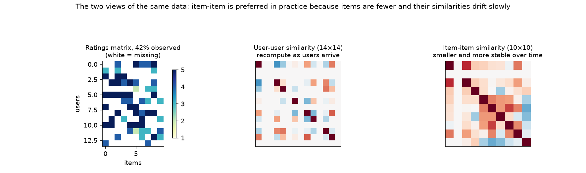

- The same ratings matrix seen two ways. The user-user similarity matrix is 14x14 and has to be recomputed as users arrive; the item-item matrix is 10x10 and its entries drift slowly, because what a film *is* does not change. That size and stability difference is the practical reason item-based filtering is the one that gets deployed.

- User-based filtering
  - Basic idea: find similar users who share the target user's interests
    - e.g., in a movie recommendation system, if one user gave a high rating to a particular film, that film is also recommended to users with a similar taste
  - 
  - Computing the similarity between users (using the Pearson correlation coefficient)
  - 

  - 
  - Dividing the covariance of users A and B by the product of their standard deviations gives the Pearson correlation coefficient

- Item-based filtering
  - Basic idea: provide recommendations using the similarity between items
    - e.g., if the majority of users rated film B highly after film A, film B can be recommended to users who prefer film A
  - 

- 

- Advantages and disadvantages of user-based collaborative filtering
  - Advantages
    1. Intuitiveness: easy to understand, because recommendations are provided based on the behaviour of users with the same taste
    2. Personalized recommendations: personalized recommendation is possible by finding similar users
    3. New items can be recommended: when a new item is added to the system it can easily be recommended in line with existing user tastes
  - Disadvantages
    1. Scalability problem: similarity computation becomes inefficient as the number of users grows. The computational cost is especially high on large-scale datasets
    2. Sparsity problem: when the user-item matrix is sparse (has many empty cells), it is difficult to find similar users
    3. Cold start problem: recommendation is difficult when there is not enough information about a new user

- Advantages and disadvantages of item-based collaborative filtering
  - Advantages
    1. Scalability: since the number of items is generally smaller than the number of users, similarity computation is more efficient
    2. Stability: the similarity between items does not change greatly over time, so more stable recommendation is possible
    3. Resolves the sparsity problem: recommendation is possible as long as the user has rated at least one item
  - Disadvantages
    1. New item problem: it can be hard to recommend a new item because similarity information about it is difficult to obtain
    2. Lack of personalization: personalization is harder than in user-based collaborative filtering, because it relies on the overall similarity of items rather than on a particular user's taste
    3. Initial training cost: computing the initial item-to-item similarities can take a great deal of time

### 6. Linear Regression
- Linear Regression: a machine learning algorithm that predicts continuous values by modelling the linear relationship between the independent variables (X) and the dependent variable (Y) in the given data (it is a machine learning algorithm, but it is also the basis of artificial neural network algorithms)
  - 
  - In the expression above 𝛽 is the regression coefficient and ϵ is the error term; the method of least squares is used to find the regression coefficients by minimizing the sum of squared errors
- 

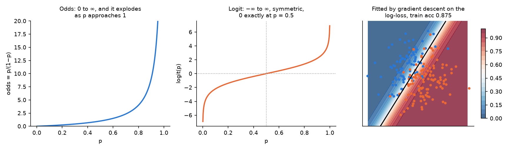

- Odds run from 0 to infinity and blow up as p approaches 1, which makes them a poor thing to model linearly. The logit fixes that: it is symmetric, unbounded in both directions, and exactly 0 at p = 0.5, so a linear model in the logit is well behaved everywhere. The third panel fits one by gradient descent on the log-loss and reports the accuracy it reached.

### 7. Perceptron & Adaline
- Perceptron: the perceptron is the most basic form of a single-layer neural network. It has a structure similar to linear regression and is used to solve binary classification problems
  - The perceptron multiplies the inputs by weights and then passes their sum through an activation function (mainly a step function) to produce a binary output
  - 
  - In the expression above, step is the step function that takes the weighted sum as input and determines the final output, w is the weight vector, 𝑥 is the input vector, and 𝑏 is the bias
  - The expression for the step function: 
- 

- Adaline: similar to the perceptron, but characterized by not applying an activation function (a step function) to the output and instead using the result of the linear function for learning
  - 
  - In the expression above w is the weight vector, 𝑥 is the input vector and 𝑏 is the bias. Adaline updates the weights using the mean squared error function, minimizing the continuous error
- 

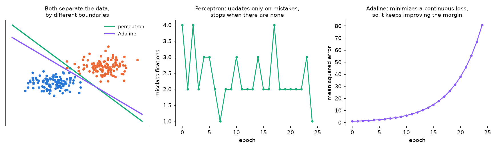

- Both find a separating line, but they get there differently and it shows in the curves. The perceptron only updates when it makes a mistake, so its error count drops to 0 and it then stops improving — any separating line will do. Adaline minimizes a continuous squared error, so it keeps refining after every point is already correct, which is what gives it a better-placed boundary and what makes it the ancestor of gradient-based training.

### 8. Logistic Regression
- Logistic Regression: a method devised to solve binary classification problems. It obtains a linear combination of the input variables and then passes it through the logit function (or logistic function) to predict a probability
  - The logit function has an S shape and takes values between 0 and 1. The result of passing through this function is interpreted as the probability that a particular event occurs, and in binary classification as the probability of belonging to the positive class
  - 
  - In the expression above 𝑃(Y=1) means the probability of belonging to the positive class, X denotes the input variables, and 𝛽 denotes the regression coefficients. The model uses maximum likelihood estimation (MLE) to find the regression coefficients that maximize the probability on the given data

- Odds: the ratio of the probability of success to the probability of failure → the value comparing the probability that a particular event occurs with the probability that it does not occur
  - As it increases from 0 to 1, the value of the odds ratio increases slowly at first and then rises sharply as p approaches 1
  - Odds Ratio: p / (1 - p) (p = probability of success)
    - e.g., what is the odds ratio when the probability of some event occurring is 80%?
      - 0.8 / (1 - 0.8) = 0.8 / 0.2 = 4

- Logit function: the value obtained by taking the natural logarithm of the odds
  - logit(p) = log(p / (1 - p))
  - 
  - It has the property of being 0 when p is 0.5, and of going to negative and positive infinity respectively as p goes to 0 and 1

- 

- Activation function: the function needed to transform the value obtained by passing through a linear function before sending it to the threshold function; a nonlinear function is mainly used
  - Why does Activation function use nonlinear function?
    - A linear function (a simple rule) separates data with a straight line, which means that no matter how deeply the layers are stacked the rule is still expressed by a single straight line. That is, repeating a linear transformation over and over is ultimately still a linear function and so carries little meaning.
    - A nonlinear function, however, can learn complex patterns in a variety of data and remains nonlinear throughout, so it satisfies the validity of a multi-layer structure. In addition, most nonlinear functions are differentiable, which makes them suitable as activation functions.
- Sigmoid function
  - 

### 9. Single Layer Neural Network
- Single-layer neural network: the simplest form of neural network, consisting of an input layer and an output layer. It can mainly include models such as the perceptron, Adaline and logistic regression, and since various activation functions can be used it can solve nonlinear problems
- 
- In the expression above f is the activation function (e.g., the sigmoid function, ReLU, etc.), w is the weight vector, 𝑥 is the input vector, and 𝑏 is the bias
- 

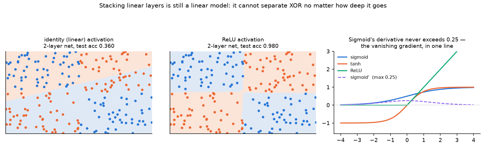

- This is the claim about nonlinearity, trained rather than asserted. Both networks have the same architecture and the same number of parameters; only the activation differs. With an identity activation the two-layer net reaches 0.360 test accuracy on XOR — worse than chance, because a composition of linear maps is a single linear map and no line separates XOR. With ReLU the same network reaches 0.980 and the boundary picks out all four quadrants.
- The dashed curve in the third panel is the derivative of the sigmoid, which never exceeds 0.25. Multiply a few of those together through the chain rule and the gradient reaching an early layer has been scaled by 0.25^n — the vanishing gradient problem in one line, and the reason ReLU replaced sigmoid in deep networks.

### 10. Multi Layer Neural Network

### 11. Convolutional Neural Network
- Summary
  - Accepts a volume of size W1 x H1 x D1
  - Requires four hyperparameters:
    - Number of filters K(Common settings: powers of 2),
    - there spatial extent F,
    - the stride S,
    - the amount of zero padding
  - Produces a volume of size W2 x H2 x D2 where:
    - W2 = (W1 - F + 2P)/S + 1
    - H2 = (H1 - F + 2P)/S + 1
    - D2 = K
  - With parameter sharing, it introduces F·F·D1 weights per filter, for a total of (F·F·D1)·K weights and K biases.
  - In the output volume, the d-th depth slice (of size W2 x H2) is the result of performing a valid convolution of the d-th filter over the input volume with a stride of S, and then offset by d-th bias.

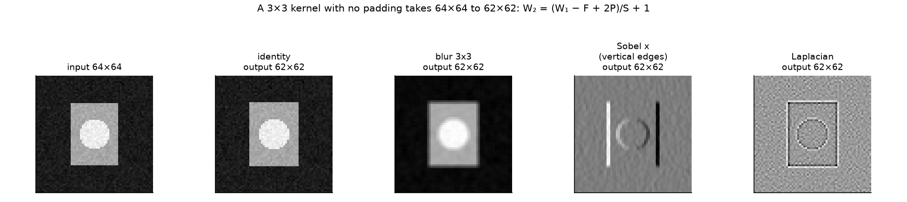

- Four 3x3 kernels applied to the same input by explicit sliding-window sum. Identity returns the image, blur averages the neighbourhood, the Sobel kernel responds to vertical edges and stays near zero in flat regions, and the Laplacian responds to curvature. A convolutional layer learns these numbers rather than being given them, but the operation is exactly this.
- The output is 62x62 from a 64x64 input, which is the formula in the summary above with F = 3, P = 0, S = 1.

### 12. Recurrent Neural Network

### 13. Long Short-Term Memory

---

## Similarity Measure
### 1. Pearson Correlation
- Pearson Correlation: possible similarity values between -1 and 1
- 

  - The closer to 1, the stronger the positive correlation
  - The closer to -1, the stronger the negative correlation
  - The closer to 0, the less correlation there is

### 2. Cosine Similarity
- Cosine similarity: computing similarity by measuring the angle between vectors
  - Dot product formula: A·B = ||A|| * ||B|| * cosθ
  - From the formula above, cosθ = A·B / (||A|| * ||B||) can be obtained
- 

---

## Evaluation Metrics
### 1. Clustering
- Adjusted Rand Index
  - 

### 2. Classification
- Confusion matrix
  - Confusion matrix: a table that categorizes predictions according to whether they match the actual value
  - The most common performance measures consider the model's ability to discern one class versus all others
    - The class of interest is known as the positive
    - All others are known as negative
  - The relationship between the positive class and negative class predictions can be depicted as a 2 x 2 confusion matrix
    - True Positive(TP): Correctly classfied as the class of interest
    - True Negative(TN): Correctly classified as not the class of interest
    - False Positive(FP): Incorrectly classified as the class of interest
    - False Negative(FN): Incorrectly classified as not the class of interest
  - 
    - T and F denote True and False: T comes when the prediction matches the actual value, and F comes when the prediction differs from the actual value
    - P and N denote Positive and Negative: P comes when the prediction denotes the positive class (1), and N comes when the prediction denotes the negative class (0)
    - e.g., when prediction=0 and actual=0, it is TN
    - e.g., when prediction=1 and actual=0, it is FP
- Accuracy: in a 2 x 2 confusion matrix, accuracy can be formulated as follows
  - 
- Error rate: the error rate is obtained by subtracting the accuracy from 1
  - 
- Precision: precision denotes the proportion of cases whose actual value is positive among those the model predicted as positive
  - 
  - Precision is easily confused with recall, but remembering the keyword "the prediction is positive" makes the denominator TP + FP easy to remember
- Recall: recall denotes the proportion of cases predicted as positive among those whose actual value is positive
  - 
  - Recall is easily confused with precision, but remembering the keyword "the actual value is positive" makes the denominator TP + FN easy to remember
- F-Score: the harmonic mean of precision and recall
  - 

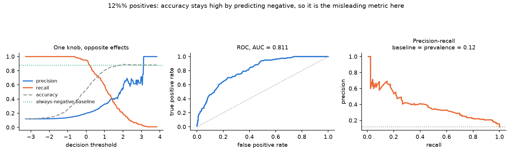

- The data here is 12% positive, which is where accuracy stops being informative: always predicting negative scores 0.88, marked by the dotted line. Precision and recall move in opposite directions as the single threshold slides, so a model is not one number but a curve. ROC is threshold-free; the precision-recall curve is the one to read under class imbalance, because its baseline is the prevalence rather than 0.5.

### 3. Regression
- Mean Squared Error (MSE)
- Mean absolute error (MAE)

---

## Etc
- Overfitting / Underfitting
  - There is a tradeoff between a model's ability to minimize bias and variance.
  - Overfitting: High variance, Low bias
  - Underfitting: High bias, Low variance

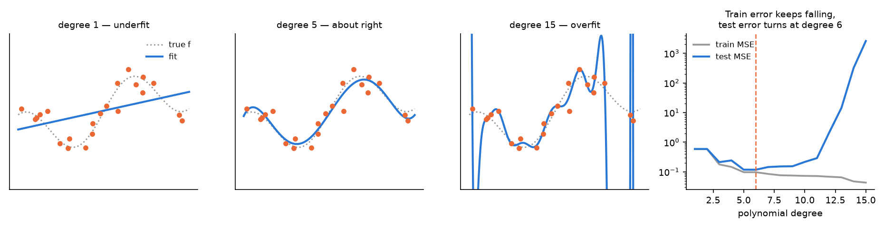

  - Polynomials of growing degree fitted to the same 22 points. Degree 1 cannot follow the curve, degree 15 passes near every training point and swings wildly between them, and the error curves on the right show the signature: training error falls monotonically while test error turns upward. The turning point is the model complexity the data supports.

- Regularization
  - L1 Regularization(Lasso)
  - L2 Regularization(Ridge)

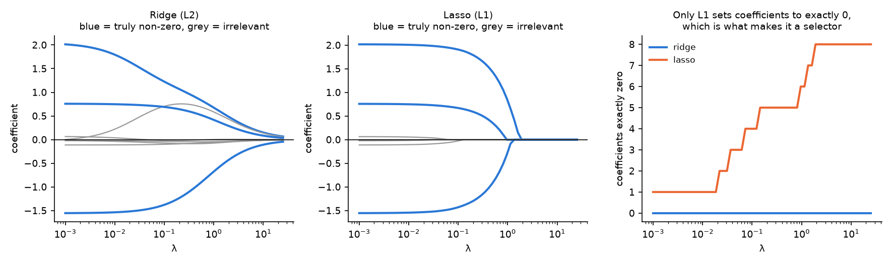

  - Coefficient paths as the penalty grows, on data where three of eight features are genuinely non-zero and two of the features are correlated with each other. Ridge shrinks every coefficient toward zero but none of them reach it. Lasso drives them to exactly zero one at a time, which is the third panel: the count of exactly-zero coefficients rises only for L1. That is what makes L1 a feature selector and L2 not, and it follows from the corner of the L1 ball lying on the axes.

- Optimization
  - Gradient Descent
    - Stochastic Gradient Descent(SGD)
    - Batch Gradient Descent(BGD)
    - Mini-batch gradient descent(MSGD)
  - Backpropagation

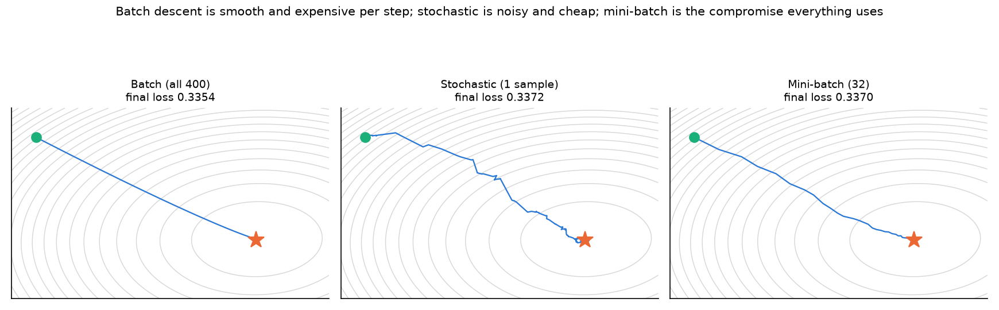

- The same regression surface descended three ways from the same start. Batch descent uses all 400 points per step and moves smoothly but pays for every step. Stochastic descent uses one point and takes a visibly noisy path, though it arrives. Mini-batch is the compromise, and the reason it is what everything actually uses: near-batch stability at a fraction of the cost, and the noise it does keep helps escape shallow minima.
